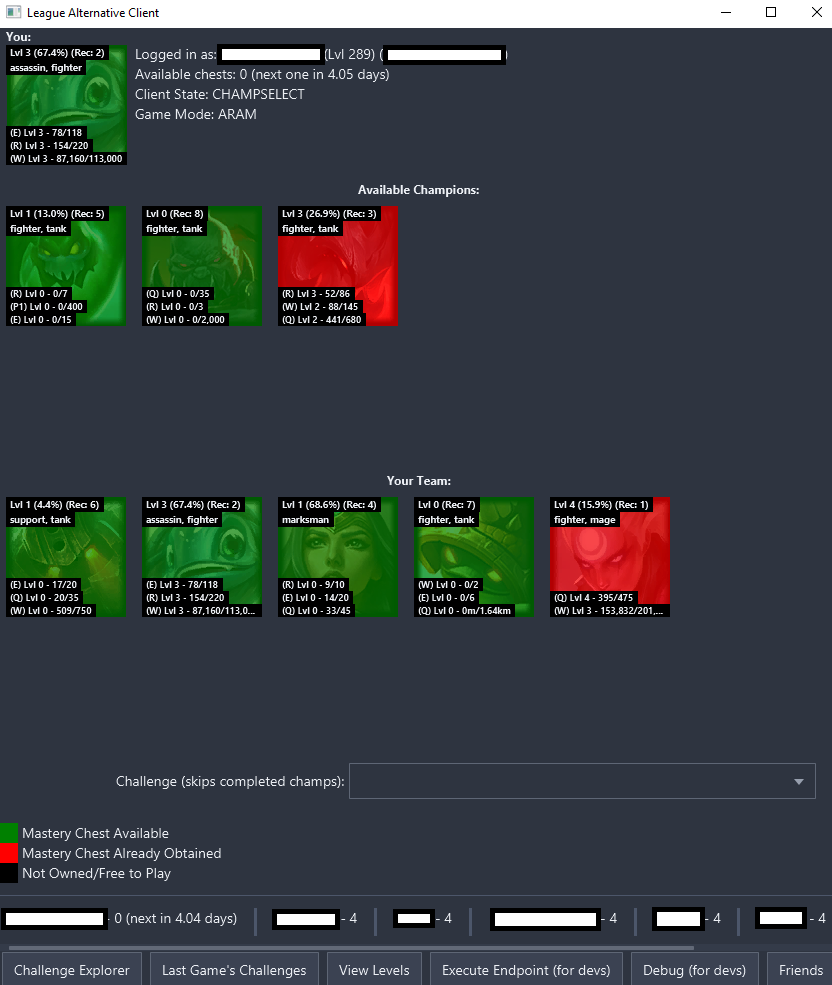
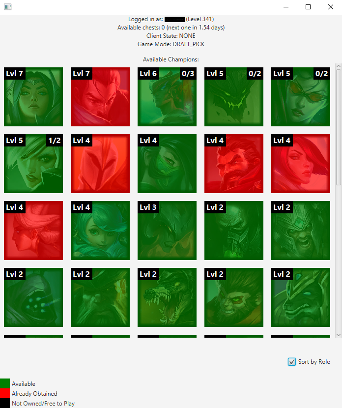

# LoL Mastery Info Client

Just a small application to let you view mastery chest and mastery token
availability information in a simple, real-time menu. It is intended to 
be run alongside the LoL client.

### How to Build a Jar
- Run `./gradle :shadowJar` or use IntelliJ's gradle plugin and look for `shadow/shadowJar`

### Supported Modes
- ARAM
  - Mastery Chest &check;
  - Mastery Tokens &cross;
  - Role Filter &cross;
- Summoner's Rift - Blind Pick
  - Mastery Chest &check;
  - Mastery Tokens &check;
  - Role Filter &cross;
- Summoner's Rift - Draft Pick
  - Mastery Chest &check;
  - Mastery Tokens &check;
  - Role Filter &check;
- Summoner's Rift - Ranked Solo/Duo
  - Mastery Chest &check;
  - Mastery Tokens &check;
  - Role Filter &check;
- Summoner's Rift - Ranked Flex
  - Mastery Chest &check;
  - Mastery Tokens &check;
  - Role Filter &check;

If you would like another mode to be supported, please make a feature 
request in the [issues](https://github.com/sabihismail/LoL-Mastery-Box-Client/issues) section.

### Example ARAM View:

### Example Normal/Draft View:

### Built With:
- [LoL Client Java API](https://github.com/stirante/lol-client-java-api) - Handles 
LoL client connection and endpoint handling
- [TornadoFX](https://tornadofx.io/) - JavaFX UI framework for Kotlin
- [AtlantaFX](https://github.com/mkpaz/atlantafx/) - Dark theme (nord-dark.css)
