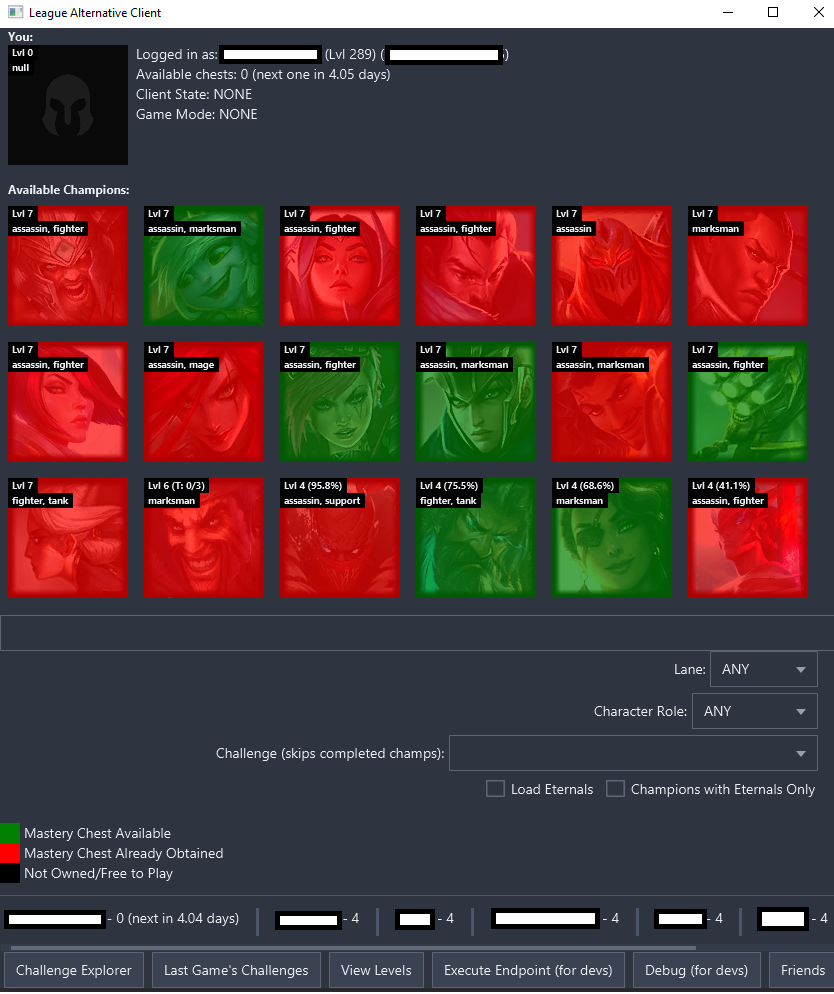

# League Completionist Client

A helper client that allows you to view a ton of extra stuff 

### Features
- Mastery chest info (multiple accounts supported)
- Challenges, Challenge Title info, and remaining Challenges per champion
- ARAM/Normal side-views
- Eternals information

### How to Use It
- Download the [latest release](https://github.com/sabihismail/LoL-Mastery-Chest-Client/releases)
and run the `.bat` file (make sure it stays in the same directory as the 
`.jar` file)

### Example ARAM View:

### Example Normals/Draft View:

### Example Challenges Overview:

### Example Remaining Levels Overview:

# Developer Info

### How to Build an Executable Jar
- Run `./gradle :shadowJar` or use IntelliJ's gradle plugin and look for 
`shadow/shadowJar`

If you would like another more utility functions, make an issue in the
[issues](https://github.com/sabihismail/LoL-Mastery-Box-Client/issues) section.

### Built With:
- [LoL Client Java API](https://github.com/stirante/lol-client-java-api) - Handles 
LoL client connection and endpoint handling
- [TornadoFX](https://tornadofx.io/) - JavaFX UI framework for Kotlin
- [AtlantaFX](https://github.com/mkpaz/atlantafx/) - Dark theme (nord-dark.css)
